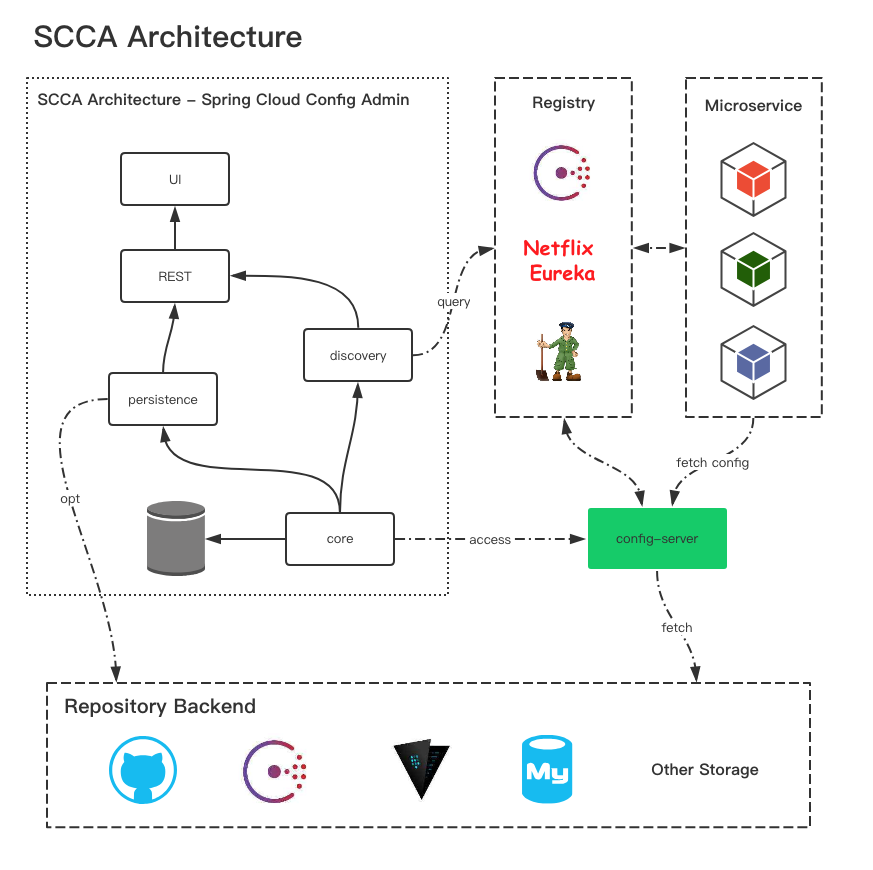

####基于scc提供的spring cloud config搭建可视化配置中心(采用db模式)
1. 架构

	
	1. scca和config共用同一个数据库
	2. **scca负责**通过web界面将项目的配置信息**保存到数据库中**
	3. **config-server负责**更具对应的client**从数据库中拉取**数据下发到客户端中
	4. 采用的1.0.0版本的scca
2. server端搭建
	1. admin搭建
		1. 添加依赖

				# 不能使用2.0的spring boot会报错
				<parent>
			        <groupId>org.springframework.boot</groupId>
			        <artifactId>spring-boot-starter-parent</artifactId>
			        <version>1.5.13.RELEASE</version>
			    </parent>

				<dependencies>
		        <dependency>
		            <groupId>org.springframework.boot</groupId>
		            <artifactId>spring-boot-starter-web</artifactId>
		        </dependency>
		        <dependency>
		            <groupId>com.didispace</groupId>
		            <artifactId>scca-rest</artifactId>
		            <version>${scca.version}</version>
		        </dependency>
		        <dependency>
		            <groupId>com.didispace</groupId>
		            <artifactId>scca-persistence-db</artifactId>
		            <version>${scca.version}</version>
		        </dependency>
		        <dependency>
		            <groupId>com.didispace</groupId>
		            <artifactId>scca-ui</artifactId>
		            <version>${scca.version}</version>
		        </dependency>
		        <dependency>
		            <groupId>com.didispace</groupId>
		            <artifactId>scca-discovery-eureka</artifactId>
		            <version>${scca.version}</version>
		        </dependency>
		        <dependency>
		            <groupId>mysql</groupId>
		            <artifactId>mysql-connector-java</artifactId>
		        </dependency>
		        <dependency>
		            <groupId>org.projectlombok</groupId>
		            <artifactId>lombok</artifactId>
		        </dependency>
		        <dependency>
		            <groupId>org.springframework.boot</groupId>
		            <artifactId>spring-boot-starter-actuator</artifactId>
		        </dependency>
		    </dependencies>
		2. application.yml
		
				server:
				  port: 10032
				scca:
				  rest:
				    context-path: /xhr
				  ui:
				    rest-server-context-path: /xhr
				    rest-server-url: http://localhost:10032
				spring:
				  datasource:
				    url: jdbc:mysql:///config_server
				    driver-class-name: org.gjt.mm.mysql.Driver
				    username: 数据库用户名
				    password: 数据库密码
				  jpa:
				    hibernate:
				      ddl-auto: update
				  application:
				    name: tlh-config-admin-db
				eureka:
				  client:
				    service-url:
				      defaultZone: http://localhost:8089/eureka/
				    healthcheck:
				      enabled: true
				  instance:
				    appname: tlh-config-admin-db
				    lease-expiration-duration-in-seconds: 5
				    lease-renewal-interval-in-seconds: 5
		3. bootstrap.yml 
		
	2. config-server搭建 
		1. 具体可以参照tlh-config-server项目中的README.md的说明，但需要修改获取配置的sql语句
		
				select p.p_key as `KEY`,p.p_value as 'VALUE' from property p inner join env e on e.id=p.env_id inner join project pt on pt.id=p.project_id inner join label l on l.id=p.label_id where pt.name=? and e.name=? and l.name=? 
3. client端搭建
	1. 和普通的config-client的搭建相同，可以参照tlh-config-server项目中的README.md的说明,直接从config-server中获取配置信息
4. **注意**
	1. 注册中心采用非认证的方式	 