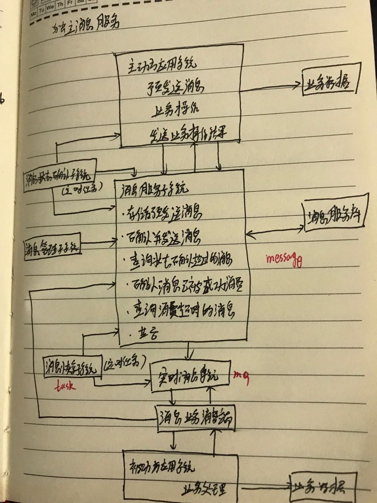

####分布式事务常用解决方案
1. 分布式事务
	1. 二阶段型
	2. TCC补偿型
	3. 最终一致性：基于实时消息系统构建
		1. 消息服务系统---->存储主动方事务操作的业务数据，并对外提供操作这些数据的方法
			1. 存储预发送的消息
			2. 确认并发送消息
			3. 查询状态确认的过时消息
			4. 确认消息已被成功消费
			5. 查询消费超时的消息
			6. .... 
		2. 消息投递系统---->定时任务，从消息服务系统获取尚未执行的消息，将其投递到实时消息系统中(具体的mq中间件) 
		3. 消息管理子系统-->消息服务系统的admin管理后台，提供对死亡消息(重试次数达到限制的消息)进行人工投递
	4. 最大努力通知
		1. 发送：调用被动方的接口，将消息推送过去但不一定都成功，通过反复的重试进行处理，次数不能操作重试次数(被动方需要幂等性设计)  
		2. 查询：同时为被动方提供查询状态的接口

####基于rabbitmq构件的可靠消息一致性
1. 整体架构

	
2. 实现 